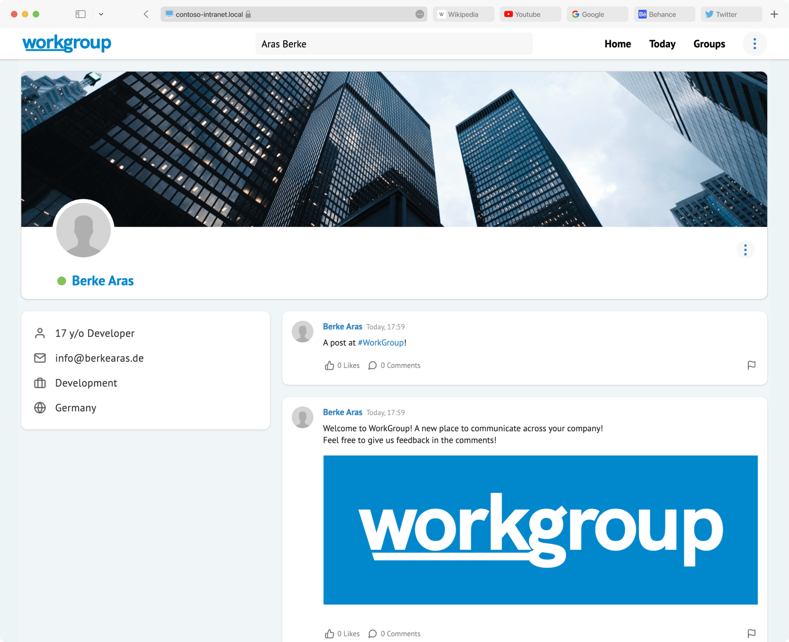

[](https://app.codacy.com/gh/BerkeAras/WorkGroup?utm_source=github.com&utm_medium=referral&utm_content=BerkeAras/WorkGroup&utm_campaign=Badge_Grade_Settings)
[](https://github.com/BerkeAras/WorkGroup/blob/master/LICENSE)
[](https://github.com/BerkeAras/WorkGroup/releases/)
[](https://github.com/BerkeAras/WorkGroup/releases/)

[](https://GitHub.com/BerkeAras/WorkGroup/graphs/contributors/)

<!-- PROJECT LOGO -->

<br /><br />

<p align="center">
  <a href="https://github.com/othneildrew/Best-README-Template">
    
  </a>

  <h3 align="center">WorkGroup</h3>

  <h4 align="center">⚠️ Warning: WorkGroup is currently in development. Most of the features are not working properly.<br><b>I am very happy about every contributor 😁</b> ⚠️</h4><br>

  <p align="center">
    Self-Hosted private Social Media for Companies
    <br />
    <a href="https://workgroup.berkearas.de/" target="_blank"><strong><i>(comming soon)</i> Learn more »</strong></a>
    <br />
    <br />
    <a href="https://github.com/BerkeAras/WorkGroup/issues/new?assignees=&labels=bug&template=bug_report.md&title=%5BBUG%5D%3A+">Report Bug</a>
    ·
    <a href="https://github.com/BerkeAras/WorkGroup/issues/new?assignees=&labels=feature+request&template=feature_request.md&title=%5BFEAT%5D%3A+">Request Feature</a>
  </p>
</p>

<!-- TABLE OF CONTENTS -->
<details open="open">
  <summary>Contents</summary>
  <ol>
    <li>
      <a href="#about-the-project">About The Project</a>
      <ul>
        <li><a href="#built-with">Built With</a></li>
      </ul>
    </li>
    <li>
      <a href="#getting-started">Getting Started</a>
      <ul>
        <li><a href="#prerequisites">Prerequisites</a></li>
        <li><a href="#installation">Installation</a></li>
      </ul>
    </li>
    <li><a href="#try-the-demo">Try the Demo!</a></li>
    <li><a href="#usage">Usage</a></li>
    <li><a href="#roadmap">Roadmap</a></li>
    <li><a href="#contributing">Contributing</a></li>
    <li><a href="#license">License</a></li>
    <li><a href="#contact">Contact</a></li>
  </ol>
</details>

<!-- ABOUT THE PROJECT -->

## About The Project




WorkGroup is an open source, selfhosted private social-media platform for companies.

Here's why:

-   Good networking is very important in companies.
-   Self hosted platforms are very important for companies with critical information.

Features:

-   Communicate through your company!
    -   Videocalls
    -   Voicecalls
    -   Textchat
    -   Groupchats
-   Socialize with your coworkers!
    -   Use the company-wide feed to share informations across the whole company
    -   Create group-feeds for different departments
    -   Create polls, upload photos, videos and other files
    -   Create events and notify users

### Built With

-   [React](https://reactjs.org/)
-   [Semantic UI](https://semantic-ui.com/)

<!-- Try the Demo -->

## Try the Demo

Sign Up at [demo1.workgroup.berkearas.de](https://demo1.workgroup.berkearas.de/)

<!-- GETTING STARTED -->

## Getting Started

To get a local copy up and running follow these simple steps.

### Prerequisites

This is an example of how to list things you need to use the software and how to install them.

-   npm
    ```sh
    npm install npm@latest -g
    ```

### Installation

1. Clone the repo
    ```sh
    git clone https://github.com/BerkeAras/WorkGroup.git
    ```
2. Install NPM packages
    ```sh
    npm install
    ```
3. Enter your configuration in `.env` (Clone the API from [WorkGroup-API](https://github.com/BerkeAras/WorkGroup-API))
    ```JS
    REACT_APP_API_URL=http://your-api-url.com
    ```

<!-- ROADMAP -->

## Roadmap

See the [open issues](https://github.com/BerkeAras/WorkGroup/issues) for a list of proposed features (and known issues).

<!-- CONTRIBUTING -->

## Contributing

Contributions are what make the open source community such an amazing place to be learn, inspire, and create. Any contributions you make are **greatly appreciated**.

1. Fork the Project
2. Create your Feature Branch (`git checkout -b feature/AmazingFeature`)
3. Commit your Changes (`git commit -m 'Add some AmazingFeature'`)
4. Push to the Branch (`git push origin feature/AmazingFeature`)
5. Open a Pull Request

<!-- LICENSE -->

## License

Distributed under the MIT License. See `LICENSE` for more information.

<!-- CONTACT -->

## Contact

Berke Aras - [@brk_ars](http://instagram.com/brk_ars) - hello@berkearas.de

Project Link: [https://github.com/BerkeAras/WorkGroup](https://github.com/BerkeAras/WorkGroup)
